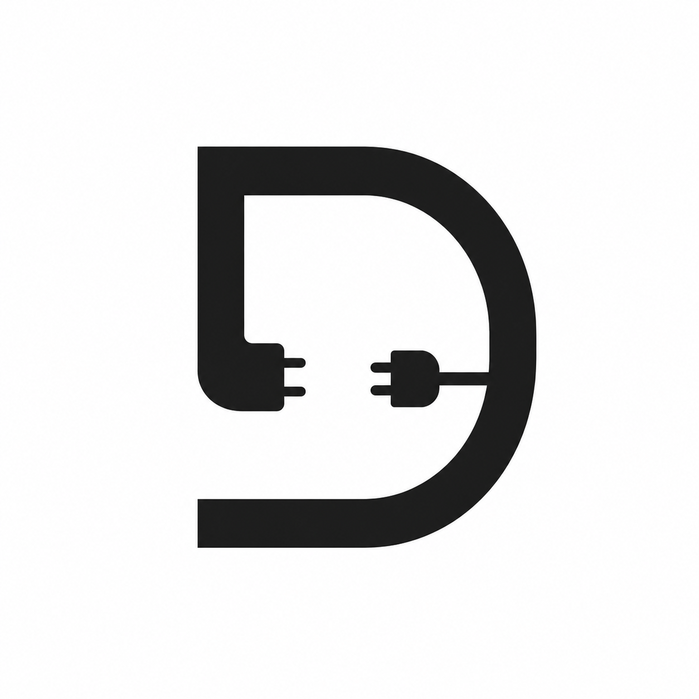

# Drop



Drop adds small, isolated browser behaviors to server-rendered Nuxt markup. Each
`defineDrop` call becomes an independent browser entry that mounts on its
component root, so it works particularly well with SSR-first pages and routes
that use `noScripts`.

## Installation

```bash
npm install @ilsrbn/drop
```

Register the module in `nuxt.config.ts`:

```ts
export default defineNuxtConfig({
  modules: ['@ilsrbn/drop'],
})
```

## Playground

The repository includes a Nuxt playground with the module already configured.
Run it locally with `npm run dev`, or browse the
[playground source](https://github.com/ilsrbn/drop/tree/main/playground).

## Quick start

Declare a behavior in a component's `<script setup>`. The `state` object is
evaluated during SSR; the callback runs in the browser after the component root
is available.

```vue
<template>
  <section>
    <button data-toggle type="button">Toggle details</button>
    <p data-message hidden>Details are open.</p>
  </section>
</template>

<script setup lang="ts">
const props = defineProps<{ initiallyOpen: boolean }>()

defineDrop({ state: { initiallyOpen: props.initiallyOpen } }, (ctx) => {
  const button = ctx.root.querySelector<HTMLButtonElement>('[data-toggle]')
  const message = ctx.root.querySelector<HTMLElement>('[data-message]')

  if (!button || !message) {
    throw new Error('Expected toggle and message elements')
  }

  const open = ctx.signal(ctx.state.initiallyOpen)

  ctx.effect(() => {
    message.hidden = !open()
    ctx.root.classList.toggle('is-open', open())
  })

  const toggle = () => open(!open())
  button.addEventListener('click', toggle)
  ctx.onCleanup(() => button.removeEventListener('click', toggle))
})
</script>
```

## API reference

### `defineDrop(options, behavior)`

`defineDrop` is a compile-time macro available globally in `<script setup>`. It
has no runtime return value. Drop removes the macro call from the Vue source,
serializes `options.state` on the rendered root, and emits `behavior` as
`/_drop/<behavior-id>.js`.

```ts
defineDrop({ state: { open: false } }, (ctx) => {
  // Browser-only behavior.
})
```

`options` must be an object with a `state` property. The callback must be an
inline arrow function or function expression with exactly one parameter named
`ctx`. It can return a cleanup function, or a promise resolving to one; Drop
registers the returned cleanup in the behavior scope.

The callback is a browser boundary. Pass server values through `state` and
create browser-only values inside the callback.

### Drop context

The callback receives `DropContext<TState>`. `TState` is inferred from
`options.state` after Vue refs are unwrapped.

#### `ctx.root`

The component's root `HTMLElement`. Use native DOM APIs to select descendants,
register listeners, set attributes, and update text or classes.

```ts
const input = ctx.root.querySelector<HTMLInputElement>('input[type="search"]')
ctx.root.classList.add('is-ready')
```

#### `ctx.state`

The typed SSR snapshot of `options.state`. It is initial data, not a
server-synchronized store.

```ts
const endpoint = ctx.state.endpoint
```

#### `ctx.onCleanup(cleanup)`

Registers `cleanup: () => void` for listeners, observers, subscriptions, and
timers. Cleanups run once when Drop remounts the same behavior, including after
a development rebuild. Registering a cleanup after disposal runs it immediately.

```ts
const observer = new ResizeObserver(() => updateLayout())
observer.observe(ctx.root)
ctx.onCleanup(() => observer.disconnect())
```

#### `ctx.signal(value)`

Creates a writable Alien Signals signal. Call it without arguments to read the
value and with one argument to write it.

```ts
const count = ctx.signal(0)
count() // 0
count(count() + 1)
```

#### `ctx.computed(getter)`

Creates a derived Alien Signals signal. `getter` receives the previous computed
value when one exists; call the returned signal without arguments to read it.

```ts
const doubled = ctx.computed(() => count() * 2)
doubled()
```

#### `ctx.effect(fn)`

Runs `fn` immediately and whenever signals read by `fn` change. It returns a
stop function and Drop registers that function with the cleanup scope, so the
effect is also stopped automatically.

```ts
ctx.effect(() => {
  ctx.root.dataset.count = String(count())
})
```

#### `ctx.load(specifier)`

Loads a browser module and returns `Promise<TModule>`. The specifier must be a
string literal. Drop compiles the call to a dynamic `import()`, so the module is
bundled for this behavior and is not evaluated during SSR.

```ts
defineDrop({ state: {} }, async (ctx) => {
  const module = await ctx.load<typeof import('some-widget')>('some-widget')
  module.mount(ctx.root)
})
```

## State serialization

Drop serializes `state` during SSR and HTML-escapes the JSON placed on the root
element. Plain objects, arrays, strings, booleans, `null`, and finite numbers
are supported. Vue refs are serialized as their current values.

State must contain only JSON-serializable values. Functions, `undefined`,
symbols, bigints, non-finite numbers, class instances such as `Date` and `Map`,
and circular references cause SSR to throw. Put server-derived values in
`state` and construct browser-only objects in the callback.

## Component contract and diagnostics

A Drop component has one `<template>` with one native HTML root element, and one
top-level `defineDrop({ state }, callback)` call in `<script setup>`. The
callback uses one `ctx` parameter. It cannot capture imports, props, or
declarations from the surrounding script; move server values into `state`.

Drop reports these build-time errors:

- `defineDrop requires an options object and one inline function`
- `defineDrop options require a state property`
- `defineDrop callback requires one ctx parameter`
- `a component can contain only one defineDrop call`
- `defineDrop cannot capture "name"; pass server values through options.state or declare browser-only values inside the callback`
- `ctx.load requires a string-literal module specifier`
- `a Drop component requires a <template>`
- `a Drop component requires one HTML root element`

Drop statically selects reactive helpers for each behavior. Access context
properties directly, such as `ctx.signal`; dynamic access such as
`ctx[methodName]` is unsupported.

## Nuxt route behavior

Drop works on ordinary Nuxt routes and is especially useful when Vue's client
scripts are omitted:

```ts
export default defineNuxtConfig({
  routeRules: {
    '/catalog/**': { noScripts: true },
  },
})
```

`noScripts` controls Nuxt's Vue client bundle. `prerender` controls whether
Nitro generates HTML ahead of time. They are independent options: a route may
use either, both, or neither.

## Runtime size

The production core runtime is capped at **5 kB gzip**. Reactivity is injected
only when a behavior statically uses `ctx.signal`, `ctx.computed`, or
`ctx.effect`; DOM-only behavior entries do not include reactive helpers. The
production `signal + effect` fixture is capped at **2 kB gzip**.

## Development

```bash
npm install
npm run dev:prepare
npm run lint
npm run test
npm run test:types
```
